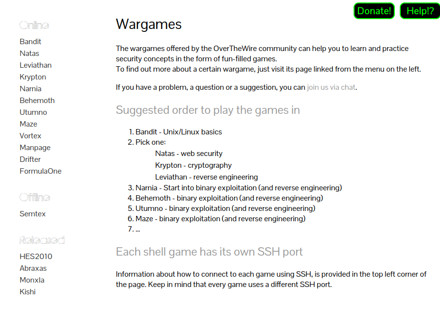

Para la realización de este proyecto hemos investigado alternativas al servicio que buscamos prestar. Una de las páginas más reconocidas por las redes es OverTheWire:

Esta página web ofrece múltiples juegos derivados de la ciberseguridad, como buscar flags en sistemas de archivos o a través de direcciones web. 

Esta sería principalmente nuestra base para diseñar nuestro proyecto. Las ideas adquiridas más notables son:
    - Creación de flags
    - Minijuegos a través de diferentes servicios
    - Servicio disponible a través de web

