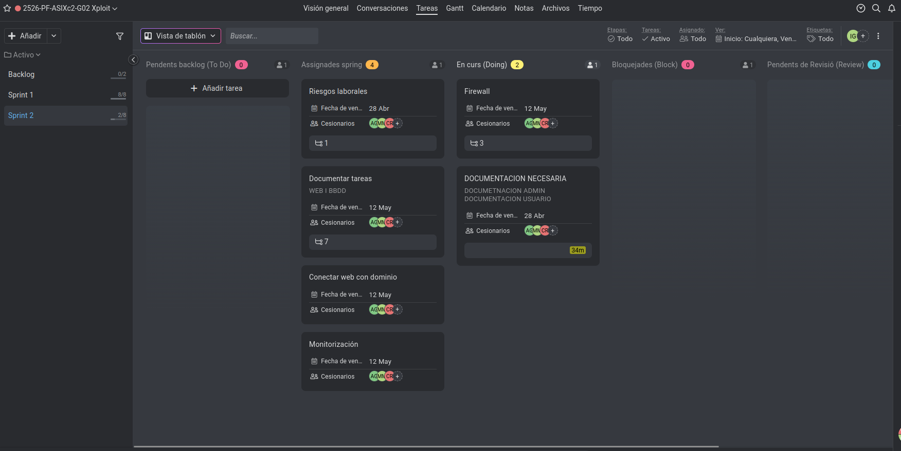

# Sprint Planning #2 — Proyecto Xploit

**Proyecto:** Xploit — Plataforma CTF
**Sprint:** #2  
**Fecha:** 27 de abril de 2026  
**Metodología:** Scrum / Agile

---

## Equipo

| Miembro | Rol |
|---|---|
| Marc Manzorro | Desarrollador |
| Carlos Rodríguez | Desarrollador |
| Adrián González | Desarrollador |

---

## Descripción del Sprint

Este sprint se centra en consolidar la infraestructura base ya desplegada, reforzar la seguridad de la plataforma web, avanzar en la conectividad de red y dominio, e iniciar la documentación técnica y funcional del proyecto. También se prepara la base para la monitorización y la organización de la web con su base de datos.

---

## Objetivo del Sprint #2

El objetivo principal de este sprint es dejar operativa y más segura la base técnica del proyecto, resolviendo problemas iniciales de la web, avanzando en firewall y conectividad, y arrancando la documentación clave del sistema y del usuario.

---

## Tareas completadas (Previas al sprint)

- **Poner seguridad a la web** — Se ha aplicado securización inicial a la web y se ha planteado la incorporación de HTTPS.
- **Arreglar web Apache** — Se han corregido problemas detectados en la web basada en Apache.
- **Creación de instancia** — La instancia necesaria para la base del entorno ya ha sido creada.

---

## Tareas del Sprint #2

### Infraestructura y Red
- **Firewall** — Continuar la configuración de seguridad perimetral y control de tráfico.
- **Configuración pfSense** — Preparar la base de segmentación y filtrado interno de red.
- **Configuración de reglas de firewall** — Definir y aplicar reglas de entrada y salida acordes a los servicios expuestos.

### Web y Dominio
- **Conectar web con dominio** — Asociar la plataforma web al dominio definido.
- **Let's Encrypt** — Implementar certificados TLS para habilitar HTTPS de forma segura.

### Monitorización
- **Monitorización** — Iniciar el despliegue del sistema de monitorización de servicios e infraestructura.
- **Entorno Alpine** — Preparar entorno ligero asociado a tareas de soporte o despliegue técnico.

### Documentación
- **Documentación necesaria** — Empezar redacción de manuales de administrador y de usuario.
- **Documentar tareas: web y BBDD** — Estructurar la lógica de web, BBDD y su conectividad.
- **Diseño de la web** — Definir la línea base del diseño visual de la plataforma.

### Análisis de Riesgos
- **Riesgos laborales** — Análisis de riesgos asociado al desarrollo y despliegue.
- **Analizar riesgos de la solución** — Evaluar riesgos técnicos y de seguridad del sistema propuesto.

---

## Backlog — Sprints Futuros

- Web con sistema de validación de flags y ranking de puntos.
- Acceso SSH con usuario de mínimos privilegios para leer flags.
- Desarrollo de niveles CTF en contenedor Apache (Fácil / Medio / Difícil).
- Inyección SQL en portal de login (contenedor MySQL).
- Búsqueda de flags en Linux Container (Nivel 1, 2 y 3).
- Servicio de backups (instancia AWS independiente).
- Joc de proves i validació del sistema (RA2).
- Defensa final del proyecto.

---

## Notas de la Sesión

- Se ha realizado la consolidación de tareas pendientes desde la herramienta de gestión ProofHub.
- Se ha dado prioridad a la seguridad (HTTPS/Firewall) antes de escalar los retos.
- La rúbrica del proyecto final sigue siendo el eje principal para las tareas de documentación.